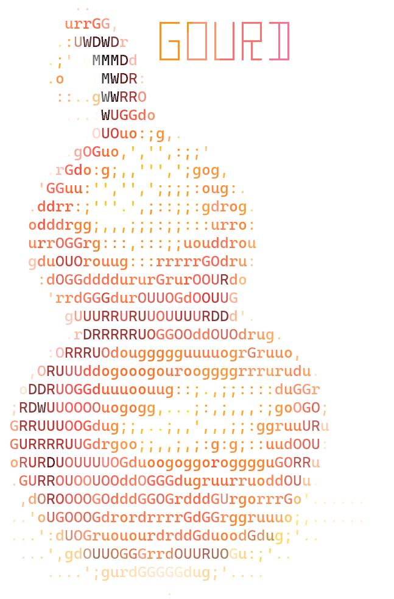

### `gourd`

**`gourd`** is a command-line tool that schedules parallel runs for algorithm comparisons.

Given the parameters of the experiment, a number of test datasets,
and algorithm implementations to compare, `gourd` runs the experiment in parallel
and provides many options for processing its results.

While originally envisioned for the DelftBlue supercomputer at
Delft University of Technology, `gourd` can replicate the experiment on
any cluster computer with the _Slurm_ scheduler, on any UNIX-like system,
and on Microsoft Windows.

### Installation

`gourd` is currently provided as a installer for various systems.

The easiest way to install `gourd` is to run the shell installer.

These binary releases can be found in the GitHub releases tab.

```
$ sudo sh install-[your system here].sh
```

This command, of course, requires a UNIX system.

For Windows simply use the two execuables provided.

<br clear="left"/>

The distributed installers are: (One of these should be put in place of `[your system here]`)
- `install-x86_64-unknown-linux-gnu.sh` - Linux systems based on gnu eg: Ubuntu, Windows WSL.
- `install-aarch-apple-darwin.sh` - Apple ARM.
- `install-delftblue.sh` - Specifically made for DelftBlue, run it without `sudo`.
- Windows exe files: `gourd.exe` and `gourd_wrapper.exe`.

Customizing installation folders is explained [here](https://gourd.chla.cz/manpages/maintainer.pdf).

### Usage

Verify that `gourd` is installed by running:
```
$ gourd version
```

Congratulations! Now you can use `gourd`.

There are extensive tutorials and documentation which can be accessed in many different formats.

With a web browser:

- [**gourd.1 in your browser!**](https://gourd.chla.cz/manpages/gourd.1.html), supports both dark and light mode!
- [**gourd.toml.5 in your browser!**](https://gourd.chla.cz/manpages/gourd.toml.5.html), supports both dark and light mode!
- [**gourd-tutorial.7 in your browser!**](https://gourd.chla.cz/manpages/gourd-tutorial.7.html), supports both dark and light mode!

As a manpage, with the `man` command:
```
$ man gourd
$ man gourd.toml
$ man gourd-tutorial
```

As a PDF file:

- [**gourd.1 in your PDF reader!**](https://gourd.chla.cz/manpages/gourd.1.pdf)
- [**gourd.toml.5 in your PDF reader!**](https://gourd.chla.cz/manpages/gourd.toml.5.pdf)
- [**gourd-tutorial.7 in your PDF reader!**](https://gourd.chla.cz/manpages/gourd-tutorial.7.pdf)

Please refer to these if you want to familiarize yourself with the software.

A good first step (as outlined in the tutorial) is to try:
```
$ gourd init [directory name]
```

### Uninstalling

Same as for the installer, the available uninstallers are:
- `uninstall-x86_64-unknown-linux-gnu.sh`
- `uninstall-aarch64-apple-darwin.sh`
- `uninstall-delftblue.sh`

### Other systems

If your system is not listed above and you are interested in maintaining
a script for it, please open a issue!

### Building

Please refer to the building section of the maintainer documentation.
An artifact is available from the GitLab pipeline `documentation` job, or
[here](https://gourd.chla.cz/manpages/maintainer.pdf)

### Authors

- Mikołaj Gazeel, m.j.gazeel@student.tudelft.nl
- Lukáš Chládek, l@chla.cz
- Ανδρέας Τσατσάνης, a.tsatsanis@student.tudelft.nl
- Rūta Giedrytė, r.giedryte@student.tudelft.nl
- Jan Piotrowski, me@jan.wf
